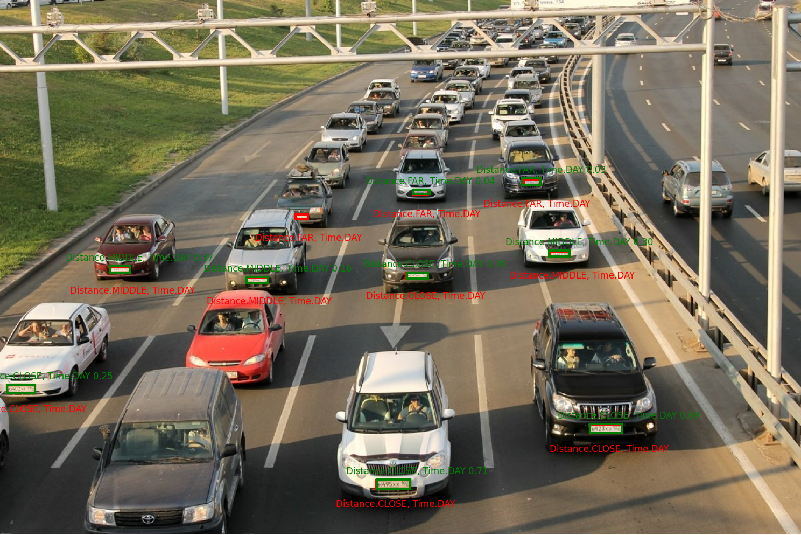

<h1 style="text-align: center; margin-bottom: 40px;">PlateScanner</h1>

<p style="text-align: center;">
    
</p>


Добро пожаловать в **PlateScanner**! Этот проект разработан для эффективного и точного распознавания номерных знаков. Наша цель – предоставить надежное решение, которое использует современные алгоритмы для распознавания и извлечения информации о номерных знаках из изображений и видео.

# Содержание

 - [Демоверсия](#-демоверсия)
 - [Начало работы](#начало-работы-)
 - - [Шаги установки](#шаги-установки)

 - [Запуск приложения](#запуск-приложения)
 - - [Train](#train)
 - - [Predict](#predict)
 - - [Validate](#validate)

 - [Метрики нейронных сетей](#метрики-нейронных-сетей)

 - [Лицензия](#лицензия)

# 🔗 Демоверсия

👉 [Демо PlateScanner](https://huggingface.co/spaces/PavelLekomtsev/PlateScanner)

🛠 Возможности демоверсии:

- ✅ Загрузка изображения с номерным знаком
- ✅ Автоматическое распознавание символов
- ✅ Визуальное отображение результата
- ✅ Проверка точности работы алгоритма

🚀 Оцените мощь наших технологий в реальном времени!
# Начало работы 
Для начала работы с **PlateScanner** убедитесь, что у вас установлена версия ***Python 3.12*** или выше. Этот проект требует нескольких зависимостей, которые можно легко управлять с помощью **Poetry**. Ниже приведены шаги для настройки проекта:

### Предварительные требования
- **Python 3.12**

## Шаги установки
1. **Клонируйте репозиторий** на свой локальный компьютер:
```bash
git clone https://github.com/encore-ecosystem/PlateScanner.git
```

2. **Перейдите в каталог** проекта:
```bash
cd PlateScanner
```

3. **Установите консольное приложение** с помощью pip или pip3:
```bash
pip3 install .
```
4. **Установите переменную окружения**, например:
```bash
set PLATESCANNER_ROOT_PATH = "$PWD"
=======
```bash
pip3 install .
```
# Запуск приложения
Чтобы посмотреть режимы работы приложения **PlateScanner**, используйте следующую команду:
```bash

platescanner help
```

**PlateScanner** предоставляет возможность предсказывать ограничивающие рамки (bounding boxes) на изображении, распознавать текст на номерных знаках, а также валидировать нейронные сети. Для этого необходимо выполнить небольшую предварительную настройку. Проект предлагает предобученные модели, которые можно загрузить по следующей ссылке: **[Models](https://disk.yandex.ru/d/s3NrpFxzpE02YQ)**. Скачайте интересующие вас модели в папку _PlateScanner/models_.

## Train
**🎯 Запуск тренировки модели**
```bash
python main.py train --weights_path <path_to_weights> --dataset_path <path_to_dataset> --use_clearml <True/False>
```
Параметры тренировки

- _weights_path_ (по умолчанию: None) – путь к файлу весов модели.

- _dataset_path_ (по умолчанию: None) – путь к директории с датасетом.

- _use_clearml_ (по умолчанию: False) – использовать ли ClearML для обучения.

Для обучения/дообучения моделей проект предоставляет скрипт _scripts/train.py_. Чтобы задать параметры, нужно:

 - **< weights_path >** : Путь до весов модели. В случае, если вы хотите обучить новую модель, загрузите её начальные веса в папку проекта.


 - **< dataset_path >** : Путь до тренировочного датасета.


 - **< augmentation >** : Аугментации, которые будут применяться в процессе тренировки, из библиотеки **Albumentations**.


Для того, чтобы изменить такие параметры, как _batch_size_, _save_period_ и _resume_ тренировки, перейдите в скрипт _src/nodeflow_enf/functions/train_yolo.py_ :


- **< batch >** :
    - При -1 batch подбирается автоматически.
    - Float из диапазона (0, 1) интерпретируется как процент заимствования видеопамяти.
    - Int [1, ...] - число batch'ей


- **< save_period >** : В папке _scripts/runs_ проекта, создаваемой скриптом тренировки, будут сохраняться веса модели с указанной периодичностью.


- **< resume >** : При тренировке с последней сохранённой эпохи передайте параметр **resume=True** в _config_ файла. Укажите _last_ веса модели из _scripts/runs_ в _weights_path_ предыдущего пункта.


Для того, чтобы изменить такие параметры, как _imgsz_ и _epochs_ тренировки, перейдите в скрипт _src/model/yolo_ultralytics/abstract.py_ , в функцию **fit** :


- **< imgsz >** : Размер изображения, который подаётся на вход модели.


- **< epochs >** : Количество эпох тренировки.


## Predict

После загрузки моделей для режима предсказания (**predict**) по порядку указывайте следующие параметры:

**🎯 Запуск predict - режима модели**
```bash
python main.py predict --weights_path <path_to_weights> --dataset_path <path_to_dataset> --output_path <path_to_output> --confidence_level <value> --detection_only <True/False>
```
 - **< weights_path >** : Укажите абсолютный путь к файлу весов модели для детекции.


 - **< dataset_path >** : Укажите абсолютный путь к папке, содержащей входные изображения или видео. **Важно отметить**, что указанная папка должна соответствовать следующей структуре: _input_path/test/images_. То есть, если вы указываете путь _PlateScanner/dataset_, изображения будут загружаться из папки _PlateScanner/dataset/test/images_.


 - **< output_path >** : Укажите абсолютный путь к папке, где будут сохранены результаты.


 - **< confidence_level >** : (Необязательный) Укажите уровень доверия для детекции в процентах.


 - **< detection_only >** : (по умолчанию: False) Укажите True только для детекции номеров, False для детекции + распознавания текста.

 
 Нажмите Enter, и начнётся процесс предсказания. После его завершения вы сможете просмотреть результаты в указанной вами выходной папке.

## Validate

Проект **PlateScanner** предоставляет пользователям специализированную валидацию. Подробнее о ней вы можете ознакомиться, перейдя по следующей ссылке: **[Новые подходы к валидации нейронных сетей в задаче детекции ГРЗ](/appendices/articles/Art1.md)**.

Чтобы запустить процесс валидации, по порядку указывайте следующие параметры:

**🎯 Запуск validate - режима модели**
```bash
python main.py validate --weights_path <path_to_weights> --dataset_path <path_to_dataset> --output_path <path_to_output> --confidence_level <value> --detection_only <True/False>
```
- **< weights_path >** : Укажите абсолютный путь к файлу весов модели для детекции.


- **< dataset_path >** : Укажите абсолютный путь к папке, содержащей входные изображения с разметкой. Важно отметить, что указанная папка должна соответствовать следующей структуре: _input_path/valid/images_ и _input_path/valid/labels_. То есть, если вы указываете путь _PlateScanner/dataset_, изображения будут валидироваться из папки _PlateScanner/dataset/valid/images_ по разметке из _PlateScanner/dataset/valid/labels_. Важное замечание: если вы хотите провалидировать модель формата OBB, то разметка labels также должна быть формата OBB. Более подробно про OBB-разметку можно ознакомиться [здесь](https://docs.ultralytics.com/ru/tasks/obb/).


 - **< output_path >** : Укажите абсолютный путь к папке, где будут сохранены результаты.


 - **< confidence_level >** : (Необязательный) Укажите уровень доверия для детекции в процентах. 


 - **< detection_only >** : (по умолчанию: False) Укажите True только для детекции номеров, False для детекции + распознавания текста.


 - **< criteria >** : Выберите номер критерия, который вас интересует. Результаты __confusion matrix__ будут строиться по указанным вами критериям. Если критерий не имеет значения, нажмите Enter _(any)_.


 - **< num of images >** : Выберите количество изображений, на которые вы хотели бы взглянуть, чтобы оценить, как нейронная сеть справилась с разметкой по указанным критериям. Будут использованы первые _n_ указанных изображений. Если вы хотите просмотреть все изображения, просто нажмите Enter. 

Результаты работы валидации и __confusion matrix__ можно будет найти в указанной вами выходной папке.


# Метрики нейронных сетей

Мы предоставляем пользователю результаты валидации нейронных сетей для детекции на таргетовом датасете, состоящем из 24 разносортных изображений при фиксированном _confidence_ = 6%.

| **Версия модели**     | **Confidence** | **TP** | **FN** | **FP** | **Precision** | **Recall** | **F1-Score** | **Обработка изображения; <br/>sec / frame**  |
|-----------------------|----------------|--------|--------|--------|---------------|------------|---------------|:---------------------------------------:|
| yolo11n-obb          | 0,06           |   18   |   57   |   4    |    0,81818    |   0,24000  |    0,37113    |                 0,4484                  |
| yolov5nu             | 0,06           |   40   |   35   |   20   |    0,66667    |   0,53333  |    0,59259    |                 0,1873                  |
| yolo11n              | 0,06           |   46   |   29   |   5    |    0,90196    |   0,61333  |    0,73016    |                 0,4525                  |
| yolo11n-obbv2        | 0,06           |   56   |   19   |   21   |    0,72727    |   0,74667  |    0,73684    |                 0,2058                  |
| yolo11x              | 0,06           |   55   |   20   |   3    |    0,94828    |   0,73333  |    0,82707    |                 0,6579                  |


А также при __Precision__ > 90%:

| Версия модели      | Confidence | TP | FN | FP | Precision | Recall  | F1-Score |
|--------------------|------------|----|----|----|-----------|---------|----------|
| yolo11n-obb        | 0,43       | 10 | 65 | 1  | 0,90909   | 0,13333 | 0,23256  |
| yolov5nu           | 0,27       | 28 | 47 | 1  | 0,96554   | 0,37333 | 0,53854  |
| yolo11n-obbv2      | 0,54       | 35 | 40 | 2  | 0,94595   | 0,46667 | 0,62500  |
| yolo11n            | 0,14       | 43 | 32 | 3  | 0,93484   | 0,57333 | 0,71072  |
| yolo11x            | 0,07       | 55 | 20 | 2  | 0,96491   | 0,73333 | 0,83333  |

### Распознавание текста (OCR)

Для оценки качества работы нейронной сети для задачи *OCR* (лучшие результаты представила нейронная сеть **parseq**) были выбраны следующие метрики:

- **Mean Average Levenstein** – одинаково наказывает ошибки в виде пропущенной, излишней или неверной буквы. Данная метрика является более показательной с точки зрения работоспособности модели. Сначала вычисляется среднее значение для каждого изображения, затем берется среднее по всему датасету.

- **Business Metric** – бинарная метрика, оценивающая точное попадание в номер. Если распознанный номер полностью совпадает с правильным – присваивается 1, иначе 0. Затем сумма всех попаданий делится на максимально возможное количество распознаваний в датасете.

**Результаты OCR-модели:**

| **Метрика**             | **Значение** | 
|-------------------------|--------------|
| Mean Average Levenstein | 0.935        |
| Business Metric         | 0.800        |


# Лицензия

Доступ к программному обеспечению предоставляется в соответствии с [EULA](LICENSE).