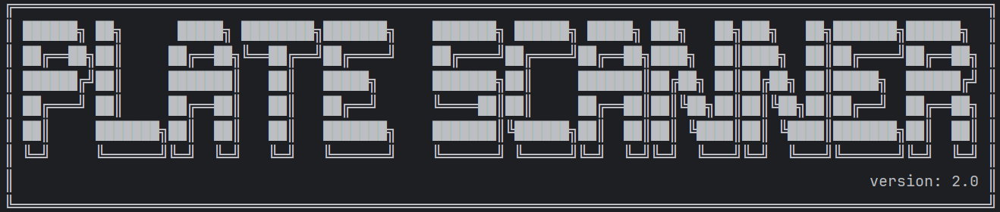
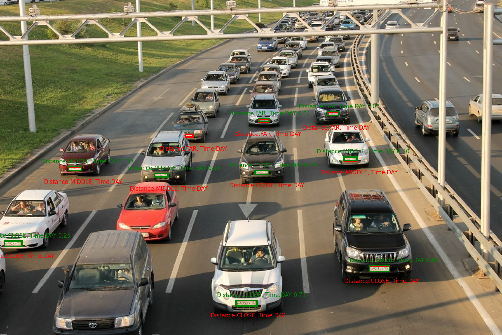
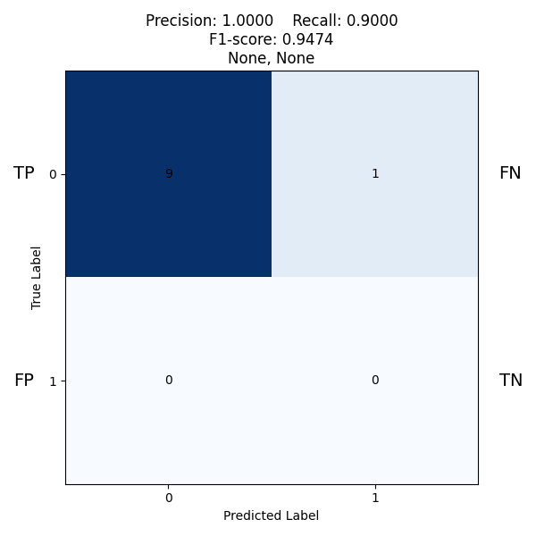

## О проекте

Команда разработчиков **Encore Ecosystem** занимается созданием программного обеспечения для _детекции_ и _распознавания_ государственных регистрационных знаков (ГРЗ). В процессе решения задачи детекции возникла важная проблема: как эффективно оценивать работу нейронной сети? Разумеется, можно использовать распространенные метрики для сравнения, такие как _mAP50_ или _mAP50-95_. Изначально мы именно так и поступали. Однако в ходе эмпирического анализа данных мы заметили, что одна из нейронных сетей демонстрировала высокие результаты при распознавании дальних номеров, но не справлялась с близкими номерами. В то время как другая сеть обладала лучшей обобщающей способностью, выявляя множество номеров, но при этом показывала меньшую точность распознавания.

В результате команда пришла к выводу о необходимости разработки новых метрик оценки, которые позволили бы более детально анализировать результаты работы разных архитектур. В данной статье мы поделимся логикой реализации нашей системы валидации. Конкретнее с реализацией алгоритмов, упомянутых в статье, вы можете ознакомиться, перейдя по следующей ссылке: [PlateScanner](https://github.com/encore-ecosystem/PlateScanner)

### Классификация по расстоянию и яркости
Для начала было принято решение об использовании автоматизированной классификации объектных ограничивающих рамок _(bounding boxes, далее bbox)_ по заранее заданным критериям. Это позволяет избежать ручной разметки, что требует значительного количества времени и труда. Мы выделили несколько классов на основе простых, но эффективных критериев: расстояния и времени суток.
```python
class Distance(Enum):
    CLOSE = 1
    MIDDLE = 2
    FAR = 3

class Time(Enum):
    DAY = 1
    NIGHT = 2
```
Основная задача заключалась в том, чтобы присвоить каждому размеченному bbox'у принадлежность к каждому из классов на основании статистических данных. Это позволит делить все bbox'ы в валидационном датасете на непересекающиеся классы по атомарному критерию. Атомарный критерий представляет собой такой критерий, у которого у каждого фильтра задано четкое, конкретное значение. Например, класс _(день, далеко)_ является атомарным, тогда как _(день, (не указано расстояние))_ — нет, так как в данном случае не определено одно из значений.

- **Применение критерия времени: алгоритм fit_brightness**

При рассмотрении критерия времени было необходимо решить задачу классификации bbox'ов по яркости изображений в валидационном наборе. Первоначально можно было бы просто подсчитать среднее значение яркости у каждого изображения и отсортировать полученные результаты, но это не учитывало бы возможные отклонения, такие как наличие исключительно темных или светлых изображений в наборе.

Для этого был собран независимый набор данных, состоящий из фотографий автомобилей и номерных знаков, сделанных как днем, так и ночью. Алгоритм  _fit_brightness_ был применён для вычисления порогового значения на основании среднего значения яркости каждого пикселя на собранных изображениях.

Изображения валидационного набора, в зависимости от прохождения порога, приобретают критерий _DAY_ или _NIGHT_. Все bbox'ы, принадлежащие этому изображению, автоматически получают класс, соответствующий критерию времени суток.

- **Применение критерия расстояния: алгоритм fit_distance**

Через этот алгоритм мы присваиваем bbox'ам классы _CLOSE_ (близко), _MIDDLE_ (средне) и _FAR_ (далеко) в зависимости от их размера и пропорции по отношению к изображению в целом. Шаги _fit_distance_ можно описать так:

1. **Вычисление площадей bbox'ов**: Для каждого bbox'а на изображении рассчитывается его площадь, выраженная в пикселях.

2. **Вычисление общей площади изображения**.

3. **Нормализация площадей bbox'ов**: Каждая площадь bbox'а нормализуется относительно общей площади изображения.

4. **Сортировка значений**: Все нормализованные площади bbox'ов помещаются в список и сортируются в порядке возрастания.

5. **Определение перцентилей**: Для сортированного списка вычисляются 33-й  и 66-й перцентильные точки, которые будут использоваться для разграничения классов.

6. **Классификация bbox'ов**: На основе вычисленных перцентильных значений bbox'ы классифицируются.

Ключевая проблема заключается в том, что использование перцентилей для конкретного изображения (вместо расчёта статистики на всём датасете) может привести к тому, что все bbox'ы могут быть, например, на близком расстоянии. Вдобавок, применение независимого датасета для определения границ классов также не является оптимальным решением, так как это может привести к несоответствию между статистикой датасета и реальными данными.

В этой связи, более целесообразным подходом является использование статистики валидационного датасета. Это позволит определить уместные границы для классов на основе реальных данных, что обеспечит лучшую адаптацию алгоритма под конкретные условия и особенности изображений.

### Использование Confusion Matrix

На данный момент мы находимся на этапе, когда каждый bbox имеет свои характеристики. Что делать дальше? Логичным шагом будет создание матрицы неточностей (_Confusion Matrix_), в которой мы посчитаем истинно положительные (_TP_), ложные положительные (_FP_), истинно отрицательные (_TN_) и ложные отрицательные (_FN_) результаты. Это позволит более чётко понять сильные и слабые стороны нейронных сетей. Кроме того, поскольку каждый класс теперь имеет определённые критерии, мы можем уточнить интересующий нас аспект, например, как нейронная сеть распознаёт bbox'ы на дальнем расстоянии в любое время суток, и вывести соответствующую матрицу неточностей.

**Определение метрик: TP, FP, TN, FN**

- **TP (True Positives)** – Истинные положительные. Это количество случаев, когда система успешно распознала номерной знак автомобиля, и это распознавание является верным. TP представляет собой число правильно идентифицированных номерных знаков.

- **FP (False Positives)** – Ложные положительные. Это количество случаев, когда система ошибочно распознала номерной знак, сообщив, что номерной знак найден, хотя на самом деле его не было (например, распознавание фонового объекта как номерного знака).

- **FN (False Negatives)** – Ложные отрицательные. Это количество случаев, когда система не распознала номерной знак, хотя он на самом деле был в кадре. Это означает, что номерной знак присутствует, но система не смогла его идентифицировать.

- **TN (True Negatives)** – Истинные отрицательные. Это количество случаев, когда система правильно не обнаружила номерной знак, когда его действительно не было. Важно отметить, что в данной задаче оценка этого параметра затруднительна, поэтому мы предполагаем, что он равен 0 (для расчёта дальнейших метрик он не понадобится). Тем не менее, если читатель хочет включить этот параметр в оценку, можно фиксировать случаи, когда в кадре не присутствует НИ ОДИН номерной знак, и система корректно об этом сигнализирует.

### Порядок расчёта статистик

Итак, теперь важно правильно рассчитать все эти метрики. Логика работы нашего алгоритма выглядит следующим образом:

1) Первоначально пользователь указывает путь к валидационному набору данных, где хранятся изображения и их разметка.

2) Далее указывается путь к выходной папке, в которой будут храниться итоговые размеченные изображения и Confusion Matrix.


3) Пользователю предоставляется выбор нейронной сети, метрики которой он хочет посчитать. На этом этапе начинают работать два основных алгоритма:

- Первый алгоритм обрабатывает размеченные значения из валидационного набора и присваивает каждому bbox'у классы по критериям, описанным ранее.

- Второй алгоритм выполняет предсказание (_predict_) на изображениях валидационного набора и получает свой набор bbox'ов. 

Далее совершается проход по каждому изображению, и если bbox из предсказания имеет коэффициент пересечения с bbox'ом из разметки (_IOU_), превышающий заранее заданное пороговое значение, то bbox'у из предсказания присваиваются те же классы, что и у bbox'а из разметки, с которым он "совпал". Если bbox из предсказания не совпадает ни с одним bbox'ом из валидационной разметки (IOU для всех bbox'ов меньше порогового значения), он считается ложным положительным результатом (FP) и получает классы на основе статистики, описанной ранее. Оставшиеся bbox'ы из валидационного набора, не имеющие совпадений, классифицируются как ложные отрицательные (FN).


4) В конце пользователю предлагается выбрать, на какие критерии он хочет обратить внимание, а также указать количество изображений, на которых он хотел бы увидеть размеченные данные. Это особенно актуально в случае, если валидационный набор слишком велик, и пользователь может выбрать небольшое количество фотографий для эмпирической проверки работы нейронной сети.


### Результаты

Посмотрим на результаты работы алгоритма на основании следующего изображения:


Получили следующий результат:



Confusion Matrix выглядит следующим образом: 


